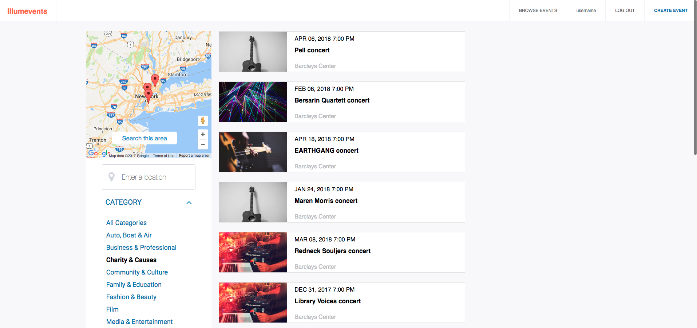

## Illumevents

[Live](https://illumevents.herokuapp.com/)

### Background

Illumevents is an Eventbrite clone built using Ruby on Rails and Postgresql on the backend and React/Redux on the frontend.

The web application allows users to browse events, bookmark them for future viewing, create events and purchase events. The actual purchase is not completed, but a purchase object is created, which renders all of the tickets that the user intended to purchase.

### Events

Events are the cornerstone of this web app, Users can conduct basic CRUD interactions, including the venue, address, date and time of the event. Users also have the ability to upload an image of the event, as well as specify the ticket quantity.  

### Tickets and Bookmarking

Events have the ability to bookmark events for future viewing. Records of the bookmark are kept through a join table. Users can access all bookmarkings through their user dashboard, which is only accessible to the current user. Tickets can be created in bulk at the time of event creation. This is conducted using the "accepts_nested_attributes_for" method in active record. The event create form component listens to changes in each event_ticket's state and keeps it nested in its own state. When the event is created, new ticket objects are created with it as well. Similarly, tickets can be purchased in bulk by using one checkout button to handle the submittal of purchases of multiple tickets, a feature implemented to mimic EventBrite's functionality. purchased tickets appear in the user dashboard as well.

### Event Categories

The application uses active record to find events by a categories associated with specific events, allowing the user to easily sort through the database to filter their interests.

### Browsing Events

Illumevents takes advantage of Activerecord's powerful querying capabilities to sort through the database based on several filters, including geolocation coordinates, date, category, and cost. Illumevents utilizes redux to pass the filters through to the backend and filter through the database in one query, limiting strain on the backend and increasing efficiency. Results are organzied into pages to limit strain on the database.

### Planned Features

Future Plans for implementation:
The next step in development of Illumevents would be to implement Google Maps functionality, allowing the user to filter results using the Google Maps API.

Adding search functionality would also be a great feature to implement, allowing the user to select different parameters to filter their results with ease.
